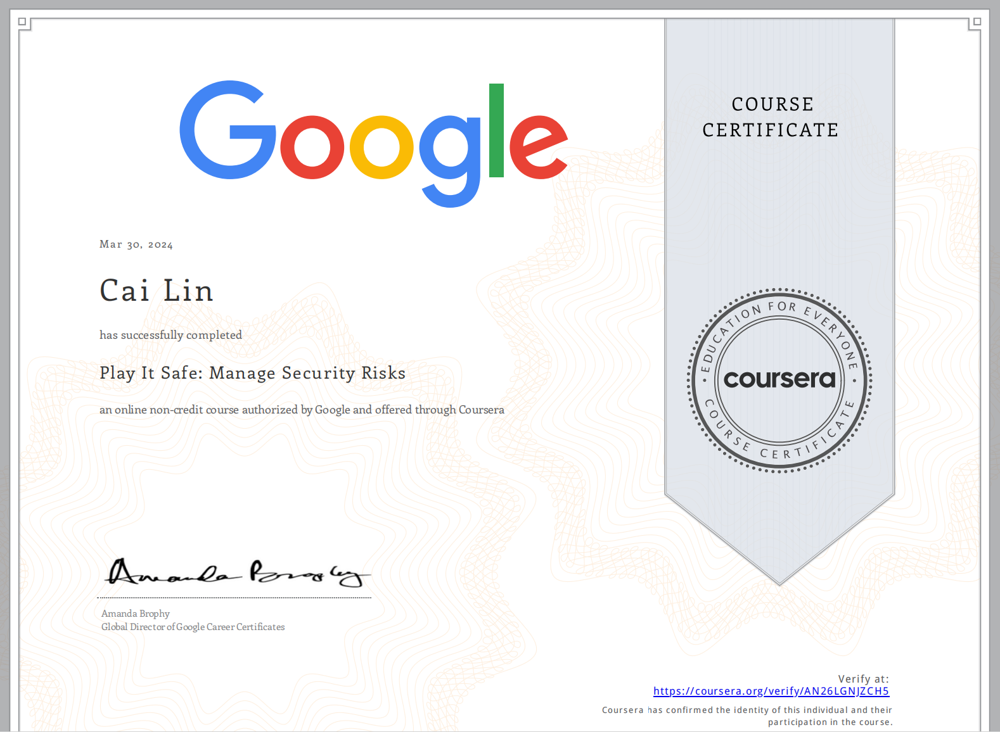

# Play-It-Safe-Manage-Security-Risks

## Module 1: Security Domains

## Module 2: Security Frameworks and Controls
    - Portfolio Activity Exemplar: Conduct a security audit

## Module 3: Introduction to Cybersecurity Tools

## Module 4: Use Playbooks to Respond to Incidents

 

# Proof of Completion

